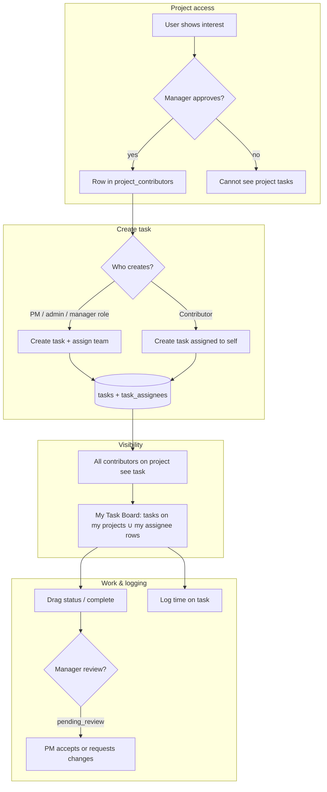

# Task flow (IntraFlow)

This document maps how tasks move through the app after checking the live Supabase schema (`tasks`, `task_assignees`, `project_contributors`, `time_logs`) and RLS helpers `can_select_task` / `can_update_task`.

## Who can see what

| Actor | Sees tasks |
|--------|------------|
| **Admin** | All tasks (broad SELECT policy). |
| **Manager** (profile role) | All tasks (policy) plus normal project rules. |
| **Project manager** (row in `project_managers`) | All tasks on managed projects. |
| **Approved contributor** (`project_contributors`) | **All tasks** on that project (via `can_select_task` + contributor clause). |
| **Assignee** | Tasks listed in `task_assignees` for them. |

**My Task Board** loads tasks with `TaskService.getMyTasks()`: union of (1) every non-deleted task on projects you contribute to and (2) tasks where you are an assignee. So contributors see the **full project task list**, not only rows assigned to them.

## Who can create tasks

- **Admin**, **manager** (global role), **project manager**, or **approved contributor** on that project may insert into `tasks` with `created_by = auth.uid()` (migration `20260327210000_contributor_task_create_assign_update.sql`).

## Who can change status / edit

`can_update_task` allows: assignee, admin, project manager, task **creator**, or **any contributor** on the project. That lets the team use the kanban board on shared tasks.

## Assignments

- **Managers / admins / project managers** can add or remove assignees freely (subject to policies).
- **Task creator** can set assignees for tasks they created.
- **Contributors** who did **not** create the task may still **self-assign** (insert a `task_assignees` row for themselves) so they can join a task managers created.

## Time logging

Users insert their own `time_logs` rows (`user_id = auth.uid()`). Logging stays on tasks they can access via normal task visibility.

## Mermaid overview

## Applying database changes

Run the SQL in `supabase/migrations/20260327210000_contributor_task_create_assign_update.sql` on your Supabase project (CLI `supabase db push` or SQL Editor). The hosted **apply_migration** MCP endpoint may not be available on all plans; the file in the repo is the source of truth.
